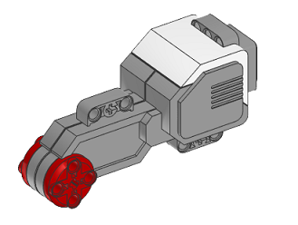
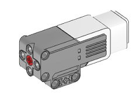

Motor
=====

There are two types of motors in the LEGO® MINDSTORMS® EV3 set:

* **Large** 

    * maximum (*no load*) speed of 175 rpm
    * maximum (*stalled*) torque of 45 N.cm

* **Medium** 

    * maximum (*no load*) speed of 260 rpm
    * maximum (*stalled*) torque of 15 N.cm

The motor encoders have a resolution of 1 degree.

.. autoclass:: pyev3.devices.Motor
    :members:
    :private-members:
    :special-members: __init__
