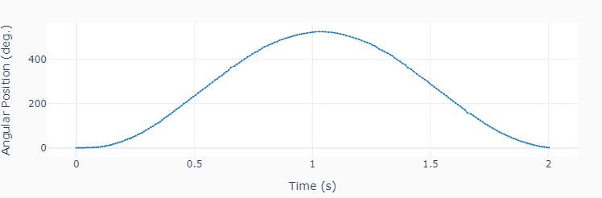
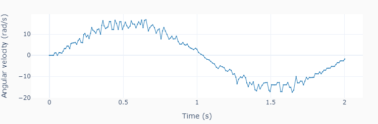
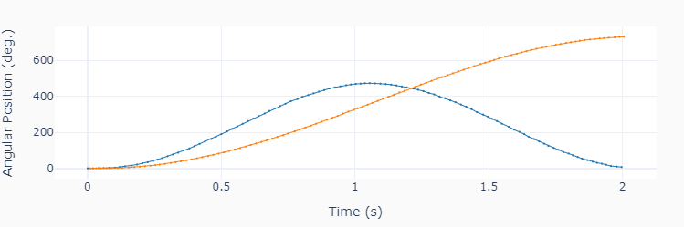
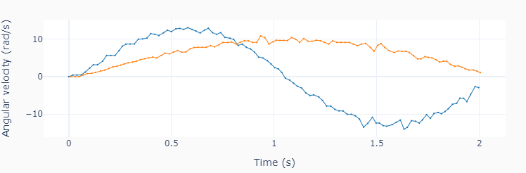
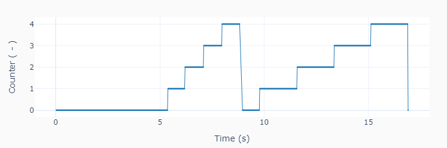
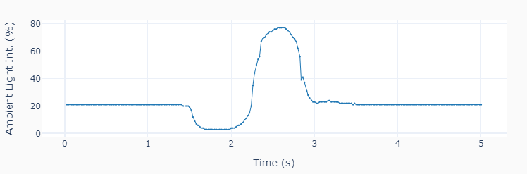
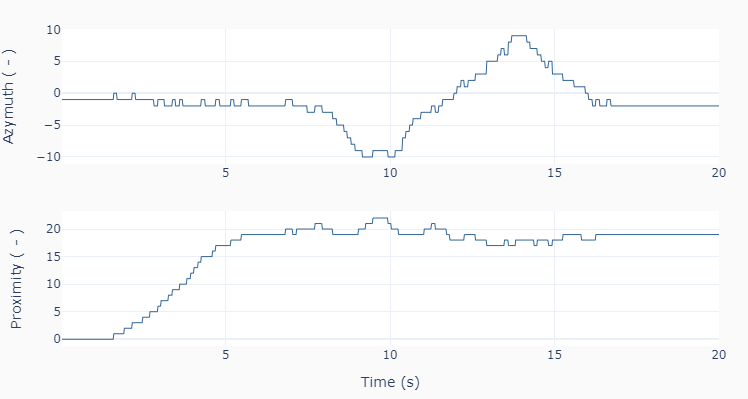
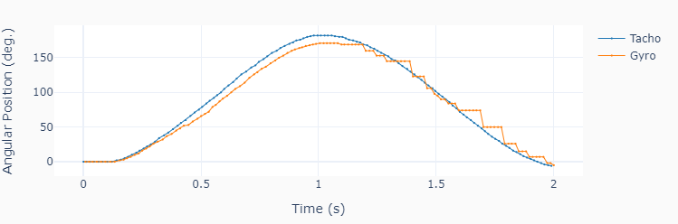
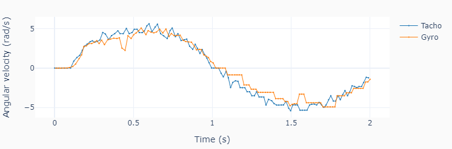

# Examples
The examples intend to show additional aspects of coding for the **EV3**
motors and sensors. To that end, they introduce the concept of execution loops
and sampling period. The sensor data is often _recorded_ to be plotted at the
end.

Always try to _see_ what the sensors are _seeing_. Looking at your data as a
function of time is a good starting point. It will help understand why things
work (or sometimes don't) as expected.

Example | Brief Description
------- | -----------------
onemotor.py | Run a sinusoidal motor speed output
twomotors.py | Run a sinusoidal speed output for two motors
counter.py | Use the touch sensor as an event counter
ambient.py | Detect the light intensity of a flashlight
obstacle.py | Detect an obstacle using the ultrasonic sensor
tracking.py | Track the LEGO® infrared beacon 
gyrorate.py | Measure angular position and velocity using a gyro

For best graphic display of the results, consider running the examples in an
interactive Jupyter notebook session (instead of a plain old terminal window).

## onemotor.py
This example shows how to precisely apply a time-based excitation (in this
case a sine wave) to a single motor. Keeping track of the current execution
time is the key to achieving that.

## twomotors.py
This example is an extension of _onemotor.py_. Its purpose is to show how
to use list comprehensions to access and run the two motors. Note also that
the current time (_tcurr_) will have different values for each motor. Using
the correct time stamp for the sine wave value calculation will produce more
accurate motion traces.

## counter.py
This example shows how to use the touch sensor to count button press events.
It resets the counter at _numcount_ at repeats the cycle _numcycle_ before
leaving the execution loop. A sampling period is used to store the time-based
data for plotting in the end.

## lightintensity.py
During the loop execution of this example, ambient light intensity is
displayed on the screen and recorded, at two different sampling periods.

## obstacle.py
This example shows how to use the ultrasonic sensor to detect an obstacle
and sound an alarm, as well as change the EV3 brick color.

## tracking.py
During the loop execution of this example code the infrared sensor tracks the
LEGO® beacon as it's moved from really close to the sensor to about 50
centimeters away. Then the beacon is moved from side to side, for about 50
centimeters as well.

## gyrodata.py
This example code, shows how use the gyro to measure angular position and
velocity by attaching it to the motor shaft.

